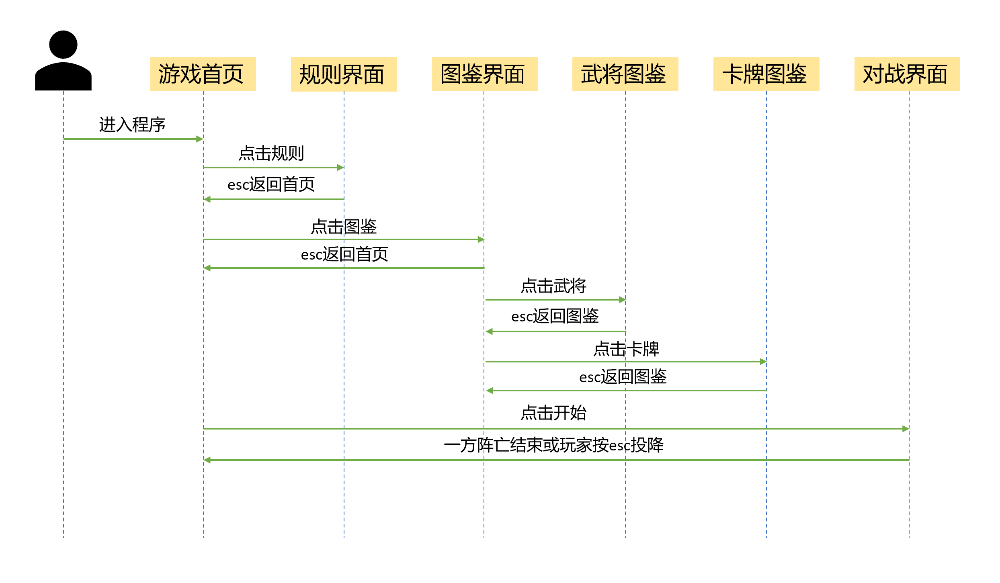
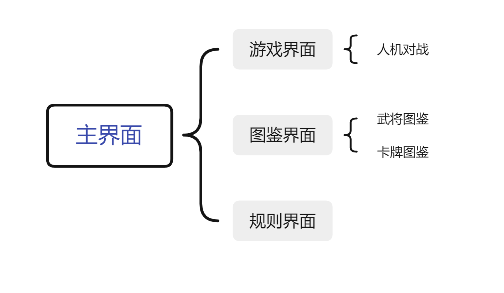

## 1.总体设计

### 1.1业务流程



### 1.2总体架构



## 2.程序描述

### 2.1功能

1. 查看基本游戏规则；
2. 查看1V1模式24名武将的技能描述，武将图片，收听武将技能台词；
3. 查看1V1模式20种共计52张；
4. 进行人机对战，总计包括12名武将，16个技能

### 2.2性能

可快速读取用户鼠标及键盘交互信息，响应玩家指令，同时内部基于红黑树对手牌优先级进行高效处理，电脑选取目前最优解进行出牌。

### 2.3输入项目

依赖用户通过鼠标和键盘输入信息。

### 2.4输出项目

通过图像，音效的形式输出交互信息。

### 2.5算法

结合当前局势信息，设计估价函数，通过排序算法，调整当前出牌策略以及棋牌策略。

### 2.6程序逻辑

#### 2.6.1每回合逻辑

```flow
st=>start: 开始游戏
 
op1=>operation: 回合开始
 
cond1=>condition: 判定能否摸牌
 
cond2=>condition: 判定能否出牌

op2=>operation: 出牌

op3=>operation: 弃牌

op4=>operation: 另一名角色回合
 
mopai=>operation: 摸牌
 
e=>end: 结束框
 
st(right)->op1->cond1
 
cond1(yes)->mopai->cond2
 
cond1(no)->cond2(right)

cond2(yes)->op2->op3

cond2(no)->op3

op3(right)->op4

op4->op1
```

每次执行操作后都会将当前玩家及电脑状态输出，未在流程图中表示，若当一方阵亡后，结束游戏。

#### 2.6.2主动技能

* 限一次技能：例如 `孙权` 的 `制衡` ，出牌阶段按下 `W` 键即可进入 `制衡` 提示界面，按下相应键即可发动技能，发动后则本回合不会再检测此技能；
* 无次数限制技能：例如 `大乔` 的 `国色` ，出牌阶段按下 `W` 键即可进入 `国色` 提示界面，按下相应键即可发动技能，且发动一次后，仍可再次发动（存在其他角色判定区不存在 `乐不思蜀` ）。

#### 2.6.3被动技能

* 增益效果技能：例如 `周瑜` 的 `英姿` ，在摸牌阶段会自动检测并发动；
* 限制效果技能：例如 `陆逊` 的 `谦逊` ，对手在使用 `顺手牵羊` 时即不能选择 `陆逊` 作为目标。

装备的实现思路与武器相同，在此不再赘述。

#### 2.6.4电脑逻辑

根据多年玩三国杀的经验积累，作为每张牌的基础评分，结合场面局势给出估价，评价每张牌在当前状态下的优劣，执行当前更优的操作，同时结合局势进行适时卖血和续爆。

## 3.系统数据结构设计

### 3.1逻辑结构设计

1. ```cpp
   struct Kapai{
       std::wstring name;
       std::wstring zhongwen;
       int dianshu;
       int huase;//0123黑红梅方
       int type;//0123基本锦囊武器防具  
   };
   ```

   每张卡牌信息包含如上基本数据类型，并设计相应构造函数及重载运算符；

2. ```cpp
   class Paidui {
   public:
   	std::vector<Kapai> _v;
   public:
   	Paidui();
   	Paidui(std::vector<Kapai> v);
   	virtual ~Paidui() = default;
   	Paidui* Shuffle();
   	Paidui* New();
   	Kapai GetFirst();
   };
   ```

   卡牌组成的牌堆，包含如上方法；

3. ```cpp
   class GameObject {
   public:
   	int _hp;
   	int _shangxian;
   	int _sha;
   	std::wstring _wujiang;
   	std::wstring _zhongwen;
   	std::vector<Kapai> _shoupai;
   	Kapai _wuqi;
   	Kapai _fangjv;
   	Kapai _yanshi1,_yanshi2;
   
   public:
       //包含武将技能等基本操作在此不再一一表述
   };
   ```

   游戏对象为武将，包含如上信息，技能基本操作等方法。

### 3.2物理结构设计要点

牌堆中卡牌采用`std::vector<Kapai>`存储，手牌采用`std::multiset<Kapai>`存储，进行优先级的排序，均采用迭代器访问，查找是采用`lower_bound`函数进行高效查找，删除时采用`erase`函数进行快速删除。